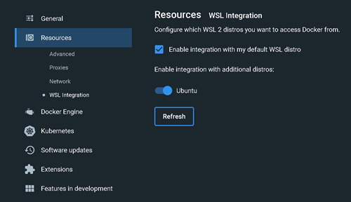
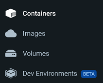

# Description
SmtpJoker allows you to create and execute basic phishing mails as jokes to set up your friends.
Through the app you will be able to create a group of "victims" which will contain one sender, whose address will be the one supposed to be sending the message, and
the others will be the receivers.

# What is MockMock ?
MockMock is a simulated SMTP server which was used to test the transmission of messages in large quantities while avoiding annoying traffic on a real server. This tool allowed us to implement our solution step by step while verifying its proper functioning and performing a large number of tests. 

# Setting up your mock SMTP server
Here is a quick guide which will allow you to run a Mock SMTP server, MockMock in this case, in order to test *SmtpJoker* while avoiding the risks that could result from a joke that would have gone wrong. 
In order to optimize the performance of the MockMock, we advise you to run it in a Docker container. To do so, follow the steps described below:

**Disclaimer**: in order to run Docker on a Windows system, it is necessary to be allowed to activate hyper-V, which is not the case on all versions. The family version, for example, does not allow it.

**However**, since 2019, it is possible to run Docker Desktop through WSL2 (https://fr.wikipedia.org/wiki/Windows_Subsystem_for_Linux). Starting from this principle, we suggest you to use WSL2 directly. You can follow these simple instructions to install it on your machine: https://learn.microsoft.com/en-us/windows/wsl/install.

1. Once WSL2 is installed and Ubuntu running, you can install Docker Desktop (https://www.docker.com/products/docker-desktop/). In settings > Resources > WSL Integration make sure the Ubuntu box is checked.

2. Optional: If needed build the MockMock project and place the output file (MockMock.jar) in the *"docker"* folder of the project (SmtpJoker)
3. To build the docker image, open a terminal in the SmtpJoker folder and launch the build-image.sh script via wsl and docker: wsl ./build-image.sh, the Dockerfile is already configured.
4. To launch the docker container, launch the script run-container.sh via wsl : wsl ./run-container.sh
5. Now you can find the MockMock in the list of containers, and it will be in status *running*.

     

6. Check if everything is alright by opening a page on localhost port 8282, You will see MockMock's welcome page.

You can now test your first campaign.

# Configuring and running a prank campaign with SmtpJoker
Configuring a campaign is really easy with SmtpJoker.
In the main folder of the project you will wee a *config.json* file, open it and fill in the *victims* and *jokes* lists. Victims must be at least 3, and you must not end the list with a coma or the app will crash.

Launch the app, and check the result on the MockMock page.

# SmtpJoker's implementation
SmtpJoker consists of three classes, **Configuration**, **Group** and **Joke**, which essentially serve as data structures:

- **Configuration** is directly deserialized from a .JSON file and will allow you to configure the application. It will input the victims (their email address) and the jokes (subject and body), and the app will take care of the rest. It has a **getRandomJoke()** method to choose a joke randomly from its list of jokes, as well as a **createGroups()** method to generate the *n* sending groups by randomly distributing the victims entered by the user into groups.
- **Joke** is a simple data structure to store the subject and body of the prank mail.
- **Group** is also a data structure, it contains the sender and the recipient(s) of a mail. The **toString()** method has been overloaded in order to visualize the group. 

## SmtpClient
Then comes the SMTP client, which is located in the **SmtpClient** class. At its creation, a host (SMTP server) and a listening port (usually 25) must be passed to it. We can then use its **sendMail()** method to which we provide a joke as well as a group, and it will take care of the communication with the SMTP server in order to send the joke.

## Commands
To communicate with the SMTP server, the **SmtpClient** class calls the SmtpCommand interface. Each SMTP command in the **commands** package implements this interface, and is responsible, in a first step, for generating its content, method **build()** and returning it as a String (the server will send it as is, encoded in UTF-8). In a second time, the **handleResponse()** method allows to manage the server's response (for example, check that the DATA response is indeed "250 Ok") and throw an exception in case of problem.

This way, it is possible to easily add new SMTP commands by creating a new class that implements this interface. Of course, the SmtpClient class must then be modified to accommodate the new commands.

## FileUtils
The FileUtils class is a file manipulation utility class.
It contains only one method, readAllText, which allows us to read the content of a file and return it as a String. It also allows us to read the content of .json files, before deserializing them thanks to the Google GSON library (https://github.com/google/gson).

## Program
Finally, the **Program** class contains the entry point of the application and links the different tools. The number of groups we want to create is passed to it as a parameter once the .JSONs have been prepared in order to go prank all night long. :)
